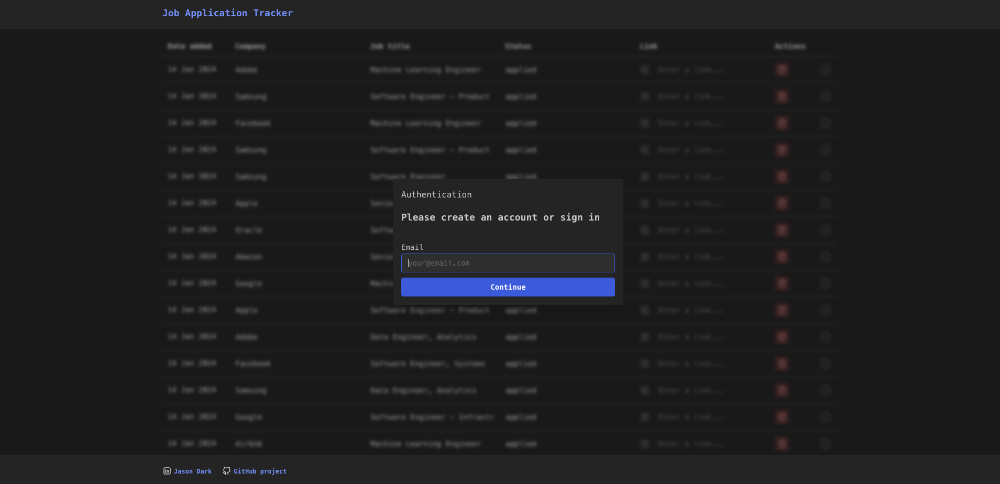

# Job application tracker

**Hello 👋. If you’re reading this, you might be considering hiring me.**

Contributing to private repos over the years has left my public GitHub a bit empty. This repo aims to showcase a simplified full-stack app so that you can see code I've written.

## Demo

[https://job-application-tracker-web.vercel.app](https://job-application-tracker-web.vercel.app)



## Run Locally

Clone the project:

```bash
  git clone https://github.com/jason-dark/job-application-tracker.git
```

Go to the project directory:

```bash
  cd job-application-tracker
```

Configure environment variables ([contact me](https://www.linkedin.com/in/jason-dark/) and I can provide them):

```bash
  mv .env.example .env
```

Install dependencies:

```bash
  yarn
```

To generate types from database structure, run the following command:

```bash
  yarn gen-types
```

Run the local Next.js and NestJS development servers:

```bash
  yarn dev
```

## Running Tests

To run all tests, run the following command:

```bash
  yarn test
```

To run tests for a specific project, use this format:

```bash
  npx nx test next-app
```

## Linting

To lint the entire project and auto fix errors, run the following command:

```bash
  yarn lint
```

## Project structure

This project has been built within a Nx monorepo which contains two apps and three libraries:

```bash
job-application-tracker
├─ apps
│  ├─ nest-api ==> NestJS CRUD API
│  └─ next-app ==> Next.js statically generated front-end
└─ libs
   ├─ constants ==> Shared constants
   ├─ types ==> Shared types
   └─ utils ==> Shared util methods
```

### [apps/nest-api](apps/nest-api/)

- This is a simple NestJS CRUD API that provides endpoints for the front end to create, update, and delete jobs.
- These are stored in a PostgreSQL DB hosted with [Supabase](https://supabase.com/docs/guides/database/overview) (chosen for no other reason that it is free).
- There is no need for public routes within the API so all routes are protected with a [NestJS Guard](https://docs.nestjs.com/guards).
- Requests must contain an `Authorization` header with a bearer token which is then validated.
- Allowed CORS origins are set in [vercel.json](apps/nest-api/vercel.json) rather than within the NestJS app itself as [Vercel](https://vercel.com/docs/deployments/configure-a-build#framework-preset) is used to deploy this API (chosen because it's free).

### [apps/next-app](apps/next-app/)

- This is a [Next.js 13 app directory](https://nextjs.org/docs/app) project. I used Next.js because the new [React docs](https://react.dev/learn/start-a-new-react-project#nextjs) recommend this rather than CRA.
- User authentication is handled using [Supabase Auth](https://supabase.com/docs/guides/auth) (for no reason other than it's free).
- [TanStack Query](https://tanstack.com/query/v3/docs/react/overview) is used to manage data fetching and caching. There is no front-end state management as such, we are syncing server state to the client.
- I have used [Mantine](https://mantine.dev/) as a UI component library. I like working with it and it's fast to build with.
- The site is [statically generated](https://nextjs.org/docs/pages/building-your-application/rendering/static-site-generation#when-should-i-use-static-generation) and deployed using [Vercel](https://vercel.com/). No server side functionality from Next.js is used, so it would be easy to host the front end on any CDN.

### [libs/constants](libs/constants/)

- Used for constants that are shared between apps or other libs.
- Import constants into apps or other libs from `@job-application-tracker/constants`.

### [libs/types](libs/types/)

- Used for types that are shared between apps or other libs.
- Types generated by `yarn gen-types` are located in `libs/types/src/lib/supabase-gen.types.ts`.
- Import types into apps or other libs from `@job-application-tracker/types`.

### [libs/utils](libs/utils/)

- Home to utility methods that could be used in any app within the monorepo.
- Import methods from `@job-application-tracker/utils`.

## CI/CD

- Vercel builds and deploys `apps/nest-api` and `apps/next-app` on any push to a branch.
- Github actions run a workflow for checking linting and running tests on any push to `master` or PR onto `master` (see [/.github/workflows/ci.yml](/.github/workflows/ci.yml)).
- Merges to master are blocked unless this workflow succeeds.

## Authors

- [@jason-dark](https://github.com/jason-dark)
